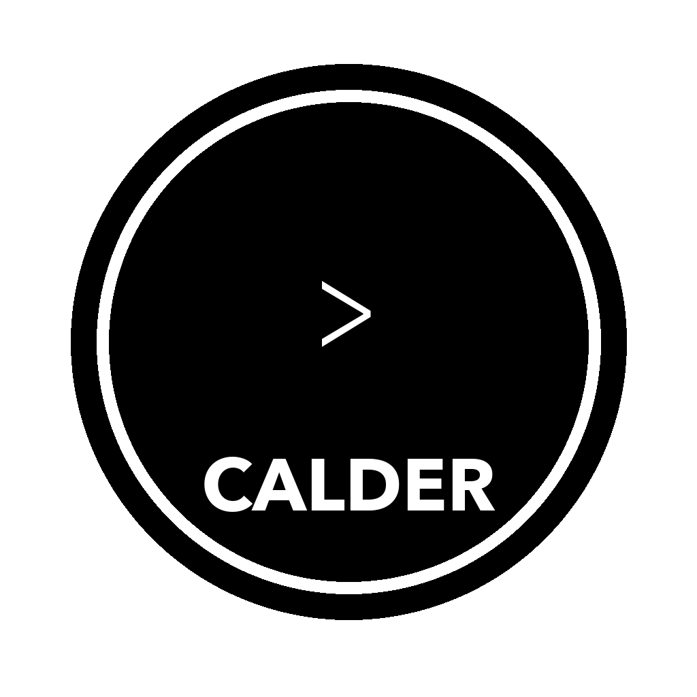

<p align="center">
  
</p>

<h1 align="center">Calder</h1>

<p align="center">
  <a href="LICENSE"></a>
  <a href="https://github.com/batu3384"></a>
  <a href="https://github.com/batu3384"></a>
</p>

<p align="center">
  <strong>The IDE built for AI coding agents.</strong><br/>
  Manage multiple agent sessions, run them in parallel, track costs, and never lose context — across modern AI coding CLIs.
</p>

---


## Why Calder?

Running AI coding agents in a bare terminal gets messy fast. Calder gives you a proper workspace — multi-session orchestration, Live View, CLI Surface inspect, cost/context tracking, and session resume — so you can focus on building instead of juggling terminals.

## Highlights

- **P2P session sharing** — share live terminal sessions with teammates over encrypted peer-to-peer connections (WebRTC), with read-only or read-write modes and PIN-based authentication
- **Multi-session management** — run multiple agent sessions per project, each in its own PTY; switch between session deck and mosaic layouts and spin up new ones with `Cmd+\`
- **Cost & context tracking** — real-time spend, token usage, and context window monitoring per session
- **Session inspector** — real-time session telemetry with timeline, cost breakdown, tool usage stats, and context window monitoring (`Cmd+Shift+I`)
- **Hybrid context discovery** — surface provider-native memory like `CLAUDE.md` alongside shared project rules, then route a compact applied-context summary into browser and CLI prompts
- **Session resume** — pick up where you left off, even after restarting the app
- **Smart alerts** — detects missing tools, context bloat, and session health issues
- **Session status indicators** — color-coded dots on each tab show real-time session state (working, waiting, input needed, completed), with optional desktop notifications
- **Live View** — open any URL (for example `localhost:3000`) inside Calder, inspect page elements, annotate flows, and route focused prompts into the right coding session
- **CLI Surface** — attach a local dev command, inspect terminal output semantically, and route compact terminal selections into an AI session without losing project context
- **Keyboard-driven** — full shortcut support, built for speed

> Supports Claude Code, Codex CLI, GitHub Copilot, Gemini CLI, Qwen Code, MiniMax CLI, and Blackbox CLI.

## Install

Requires at least one supported CLI installed and authenticated. Common setups include [Claude Code](https://docs.anthropic.com/en/docs/claude-code), [OpenAI Codex CLI](https://github.com/openai/codex), [GitHub Copilot](https://docs.github.com/en/copilot), and [Gemini CLI](https://github.com/google-gemini/gemini-cli).

### macOS

Prebuilt `.dmg` installers will be published after the public repository is live on [GitHub](https://github.com/batu3384). For now, use the source build flow below.

### Linux

Prebuilt `.deb` (Debian/Ubuntu) and `.AppImage` (universal) packages will be published after the public repository is live on [GitHub](https://github.com/batu3384). For now, use the source build flow below.

```bash
# Debian/Ubuntu
sudo dpkg -i calder_*.deb

# AppImage
chmod +x Calder-*.AppImage
./Calder-*.AppImage
```

### Windows

Prebuilt Setup `.exe` (NSIS installer) and portable `.exe` packages will be published after the public repository is live on [GitHub](https://github.com/batu3384). For now, use the source build flow below.

### npm (macOS, Linux & Windows)

```bash
npm i -g calder
calder
```

On first run, the app is automatically downloaded and launched. No extra steps needed.

### Build from Source

Once the repository is published, replace `<REPO_URL>` with the official GitHub URL.

```bash
git clone <REPO_URL>
cd calder
npm install && npm start
```

Requires Node v24+ (see `.nvmrc`).

### CLI Surface Demo Fixture

If you want a local terminal UI that already speaks Calder's semantic inspect protocol, run:

```bash
npm run demo:cli-surface
```

Inside the demo:

- `j` / `k` or arrow keys move focus
- `d` toggles dirty state
- `q` exits

This is useful for testing `CLI Surface` inspect behavior end-to-end without needing a separate external TUI project.

Inside Calder itself, `CLI Surface` now offers the same built-in demo from the suggestion modal whenever Calder cannot confidently detect a project launch command. That gives you a one-click way to preview inspect, routing, and semantic selection before wiring your own CLI profile.

## Contributing

PRs welcome! See the [Contributing Guide](CONTRIBUTING.md) and [Code of Conduct](CODE_OF_CONDUCT.md).

## License

[MIT](LICENSE)

---

<p align="center">
  <a href="https://github.com/batu3384"></a>
</p>

<p align="center">
  If Calder helps your workflow, follow the profile to catch the public repo launch and releases.
</p>

<p align="center">
  <sub>Calder is an independent project and is not affiliated with or endorsed by Anthropic.</sub>
</p>
