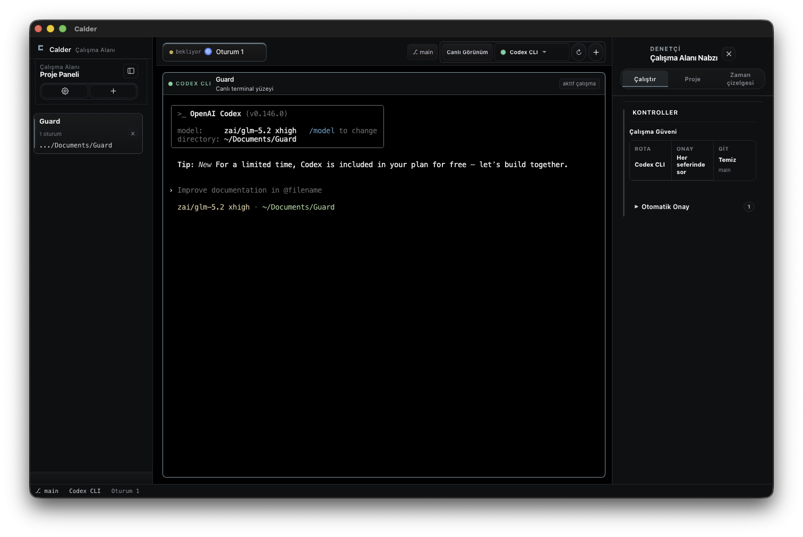
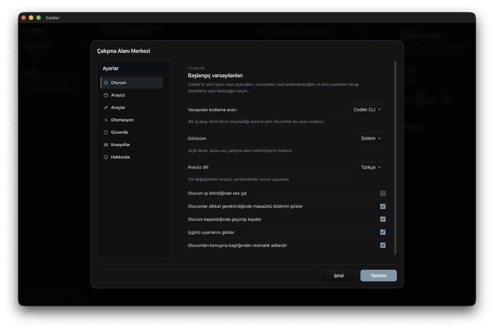

<p align="center">
  
</p>

<h1 align="center">Calder</h1>

<p align="center">
  <a href="LICENSE"></a>
  <a href="https://github.com/batu3384/calder/actions/workflows/ci.yml"></a>
  <a href="https://github.com/batu3384/calder"></a>
  
</p>

<p align="center">
  <strong>Terminal-centric Electron workspace for parallel AI coding CLI sessions.</strong><br/>
  Run multiple agent terminals per project, inspect session telemetry, route browser context into the right session, and keep governance and project workflows in one shell.
</p>

## Screenshots

<p align="center">
  
</p>
<p align="center">
  <sub><strong>Workspace</strong> — Claude Code, Codex, Cursor, and Antigravity sessions side by side with embedded browser and Workspace Pulse inspector.</sub>
</p>

<p align="center">
  
</p>
<p align="center">
  <sub><strong>Workspace Center</strong> — launch defaults, provider health, auto-approval governance, shortcuts, and updates.</sub>
</p>

---

## Overview

Calder is an Electron desktop app for developers who work primarily through AI coding CLIs.

Instead of juggling detached terminal windows and losing session context, Calder provides:

- **Multi-session orchestration** — one PTY-backed terminal per session, per project
- **Provider-aware launch and resume** — defaults, history, and mixed-provider layouts
- **Session telemetry** — hook-driven status, cost signals, and inspector timeline events
- **Browser + terminal in one flow** — inspect pages, capture context, and route prompts to the active CLI session
- **Project governance** — context scaffolding, workflows, and auto-approval with global, project, and session precedence

The UI is English by default with Turkish localization across shell, settings, and inspector surfaces.

## Supported AI Coding CLIs

Calder ships first-class adapters for these provider IDs:

| Provider ID   | CLI              |
| ------------- | ---------------- |
| `claude`      | Claude Code      |
| `codex`       | OpenAI Codex CLI |
| `cursor`      | Cursor CLI       |
| `antigravity` | Antigravity CLI  |

Set per-project defaults and run mixed-provider sessions in the same workspace.

Capability depth varies by provider (cost parsing, hook telemetry, plan mode, auto-approval dispatch). Calder surfaces what each adapter exposes instead of pretending every CLI behaves the same.

## Core Capabilities

### 1) Multi-Session Workspace

- Multiple sessions per project, each backed by its own PTY
- Tab and mosaic layouts with fast session switching
- Session labels, status indicators, unread state, and resume support
- Session history and checkpoint restore where the provider allows it

### 2) Session Telemetry & Cost Insight

- Hook-based session status (`working`, `waiting`, `input`, `completed`)
- Provider-aware usage and cost parsing where available
- Workspace Pulse timeline with tool and approval events
- Diagnostics when tracking or context pressure is unavailable

### 3) Embedded Browser & Prompt Routing

- Open local dev servers or arbitrary URLs inside Calder
- Inspect elements, draw annotations, and record simple browser flows
- Route compact context and targeted instructions to a chosen CLI session
- Keep browser findings and terminal work in one workspace instead of alt-tabbing

### 4) Context & Governance

- Project-level context discovery and starter scaffolding
- Shared rules and team-context integration paths
- Auto-approval governance with global, project, and session-level precedence
- Provider-aware approval dispatch on supported CLIs

## System Requirements

- Node.js `v24` (see `.nvmrc`)
- npm (bundled with Node)
- One or more supported AI coding CLIs installed and authenticated
- macOS, Linux, or Windows

## Installation

### Option A: Prebuilt Releases

Use assets published in [GitHub Releases](https://github.com/batu3384/calder/releases) when available.

- macOS: `.dmg` / `.zip`
- Linux: `.deb` / `.AppImage`
- Windows: NSIS installer / portable `.exe`

### Option B: Build From Source

```bash
git clone https://github.com/batu3384/calder.git
cd calder
npm install
npm start
```

## Development

Canonical setup, build, and validation commands:

- [docs/development-workflow.md](docs/development-workflow.md)

Quick local path:

```bash
npm install
npm run hooks:install
npm run dev
```

## Architecture Snapshot

```text
src/
  main/         Electron main process — PTY orchestration, providers, governance,
                hooks, IPC handlers
  preload/      Secure bridge APIs exposed to renderer
  renderer/     UI — sidebar, tabs, terminal panes, browser surfaces, inspector
  shared/       Shared runtime types and contracts
```

## Keyboard-First Workflow

Calder is built around shortcuts and fast panel switching. Defaults ship with the app; per-user overrides are supported.

Common examples:

- New session: `CmdOrCtrl+T`
- Alternate new session: `CmdOrCtrl+Shift+N`
- New project: `CmdOrCtrl+Shift+P`
- Toggle sidebar: `CmdOrCtrl+B`
- Session inspector: `CmdOrCtrl+Shift+I`

## Security Notes

- Renderer-to-main communication is explicit through preload IPC surfaces.
- Session sharing uses encrypted peer-to-peer transport (WebRTC data channels).
- Security policy and reporting instructions: [SECURITY.md](SECURITY.md)

## Contributing

Contributions are welcome.

- Start with [CONTRIBUTING.md](CONTRIBUTING.md)
- Follow [CODE_OF_CONDUCT.md](CODE_OF_CONDUCT.md)
- For security-sensitive findings, use [SECURITY.md](SECURITY.md)

## License

[MIT](LICENSE)

---

<p align="center">
  <sub>Calder is an independent project and is not affiliated with or endorsed by Anthropic, OpenAI, Cursor, Google, or other CLI vendors listed above.</sub>
</p>
